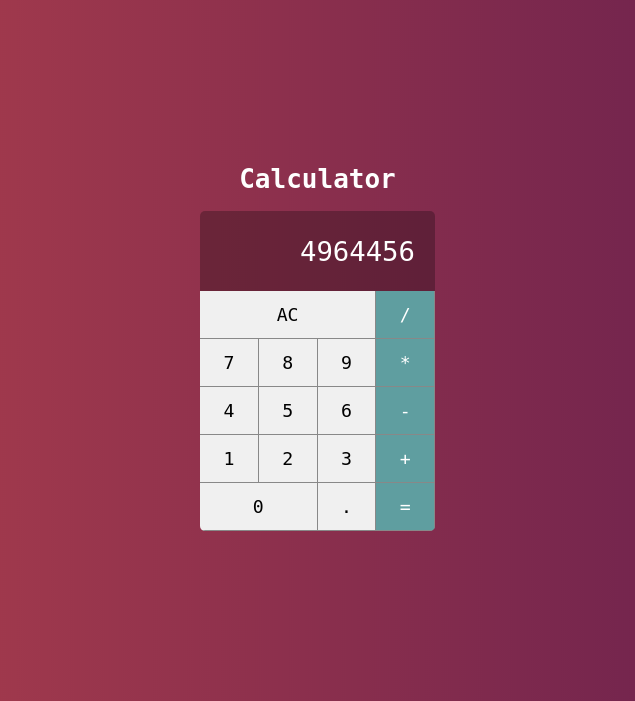

<h1> React Calculator</h1>

Projeto simples destinado ao aperfeiçoamento no framework React.
    Trata-se de um App desenvolvido com o backend em nodejs e o frontend desenvolvido com React.
    As funcionalidades do app são bem básicas e servem apenas para explorar o conteúdo do framework.
    Com ele é possível realizar os cálculos aritméticos usuais.

Links Úteis: 

<a href="https://pt-br.reactjs.org/">https://pt-br.reactjs.org/</a>

<h3>Aparência da home</h3>

OBS: para funcionar o projeto é preciso que primeiro acesse cada
     pasta e rode npm i. Depois verificar as portas que se 
     encontram cada parte do projeto pra visualizar.
